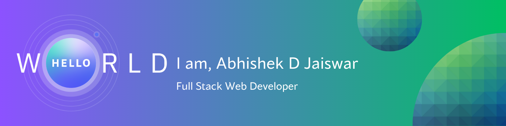

# Hello, I am Abhishek Jaiswar 👋🏻

## About me

- 🌱 I am a Full Stack Web Developer
- 🌐 Personal Portfolio : [Abhishek Jaiswar's Portfolio](https://abhishekjaiswar.pages.dev)
- 🧑🏻‍💻 A Full Stack Web Developer at [ByteSchool](https://byteschool.in/)

## I'm a tech enthusiast who loves to learn about new things

## Connect with me on LinkedIn and X (Twitter)

<!--  -->

## Want to collaborate on a project, shoot me an email at

## 🧑🏻‍💻 Skills

- HTML
- CSS
- Bootstrap CSS
- Tailwind CSS
- ShadCN UI
- Javascript
- React Js
- Redux Js
- REST API
- Core Java
- MySQL
- MongoDB

## Profile Views

<!-- Initial README Content -->
<!-- **abhishekjaiswar221/abhishekjaiswar221** is a ✨ _special_ ✨ repository because its `README.md` (this file) appears on your GitHub profile. -->

<!-- ## Hello Folks, I'm Abhishek D Jaiswar 👋

### 🧑🏻‍💻 A Full Stack Web Developer -->
<!-- **abhishekjaiswar221/abhishekjaiswar221** is a ✨ _special_ ✨ repository because its `README.md` (this file) appears on your GitHub profile. -->

<!-- # Hello Folks, I'm Abhishek D Jaiswar 👋

## 👨🏼‍💻 I'm a Full Stack Web Developer -->
